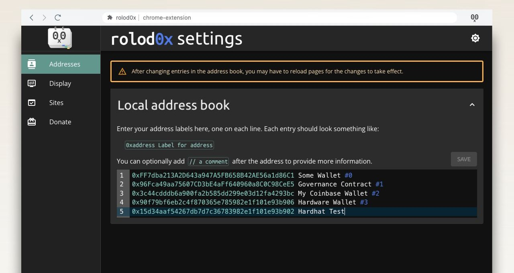
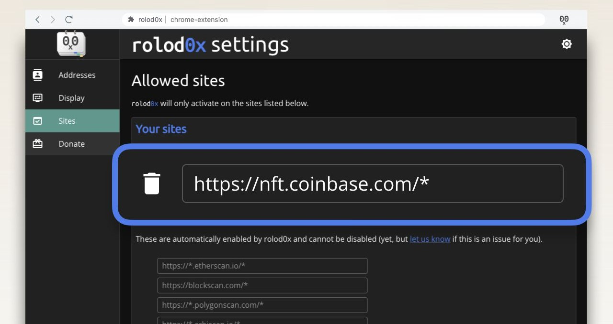
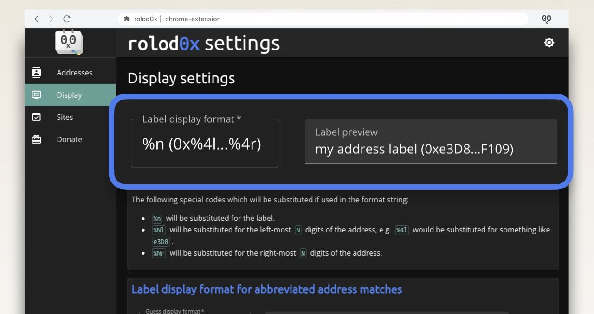

# User manual

<!-- markdownlint-disable MD033 -->

- [First steps after install](#first)
- [Adding labels to the address book](#adding)
- [Editing the address book](#editing)
- [Handling of duplicate labels](#duplicates)
- [Controlling which sites rolod0x is active on](#allow-list)
- [Looking up an address](#lookup)
- [Actions on addresses](#actions)
- [Customizing the label display format](#display)
- [Managing settings](#managing)
- [Usage in other browsers](#other)
- [Usage on the command line](#cli)
- [Importing token lists on the command line](#import-tokenlist)

The following instructions are for Chrome and Firefox.  They should
also apply to other browsers in the same families, e.g. Chromium and
Brave, although some details may differ.  (If you notice differences
not documented here, please [let us know](../CONTRIBUTING.md)!)

## First steps after install <a name="first"></a>

### Pinning the extension <a name="pinning"></a>

Once the extension is installed, it is recommended to pin it to the
toolbar.  This can done by clicking the jigsaw icon near the top right
of the browser window, finding the extension in the list, and then
clicking the pin icon.


### (Re-)opening the settings <a name="reopening"></a>

On install, the extension's options page will automatically open, but
you can re-open it later in the normal way, e.g. by clicking on the
extension icon if it's pinned as per above, or again via the jigsaw
icon.  In Chrome you then have to click the icon with the three
vertical dots to the right of the extension.  In Firefox first select
`Extensions` in the left-hand sidebar, look for rolod0x, then click
the three horizontal dots and select `Preferences`.

In Chrome you can also get to the same place via the address
<chrome://extensions>, or in Firefox the address is <about:addons>.

## Adding labels to the address book <a name="adding"></a>

There are two ways to do label an address.  The easiest is simply to
right-click on it, and then select the rolod0x option from the context
menu:

[](./images/right-click.jpg)

**Currently this only works if rolod0x is enabled on that website**
(see the [the section below on controlling which sites are
allowed](#allow-list)).  However [a fix for this is
planned](https://github.com/rolod0x/rolod0x/issues/216), so in future
right-click will work on any site.

After adding the label, you should see the address you right-clicked
on immediately replaced with the label.  To ensure that this happens
for this website in the future, you will also need to make sure that
rolod0x is enabled for that site, unless it's one of the built-in
sites listed under the "Sites" section of the settings.  See [the
below section](#allow-list) for how to do that.

## Editing the address book <a name="editing"></a>

The second way to add addresses is from the options page, which is
also how you can edit existing entries:

[](./images/edit-as-text.jpg)

1. Add or edit addresses to your address book as directed by the help
   text.

2. Click the `Save` button.

3. Visit a web page where those addresses are displayed.

4. You will now need to make sure that rolod0x is enabled for that
   website, unless it's one of the built-in sites listed under the
   "Sites" section of the settings.  See [the below
   section](#allow-list) for how to do that.

5. At this point, you should see that the addresses on the web page
   have been replaced with the labels you provided in the extension
   options.  If not, try simply reloading the web page.

## Handling of duplicate labels <a name="duplicates"></a>

Note that if you enter the same address multiple times with different
labels, when replacing labels with addresses, rolod0x will
automatically join the labels together with a `/` character in between
each label.  The same applies for comments.

## Controlling which sites rolod0x is active on <a name="allow-list"></a>

rolod0x is enabled by default on a bunch of well-known block explorers
and other sites.  However you can also manually enable rolod0x on any
site as follows:

- If you have pinned the extension to the toolbar, you can right-click
  the extension icon and make sure that `Enable rolod0x on this domain`
  is selected.

- Otherwise, you can reach the same context menu by clicking the three
  dots icon mentioned [above](#reopening).

You can view and control the list of enabled sites in the `Sites`
section of the options page:

[](./images/enable-per-site.jpg)

At this time it is not possible to disable rolod0x on the built-in
sites, however if you need that functionality, please upvote
[issue #215][215].

[215]: https://github.com/rolod0x/rolod0x/issues/215

There is also [issue #74][74] which is an idea
for a future feature to allow temporarily disabling of rolod0x for the
current tab.

[74]: https://github.com/rolod0x/rolod0x/issues/74

## Looking up an address <a name="lookup"></a>

If you want to quickly obtain an address, you can click the extension
icon and select the `Search` menu item.

Alternatively you can press a keyboard shortcut to launch a popup
window to do a lookup.  By default, this hotkey is
`Shift`-`Alt`-`Space` on Windows and Linux, and
`Shift`-`Command`-`Space` on MacOS, but you can customize this by
visiting <chrome://extensions/> and then clicking on `Keyboard
shortcuts`.

[](./images/hotkey-lookup.jpg)

This hotkey should work on any regular website, even ones on which
rolod0x has not yet been enabled.  However it will not work on
"special" pages, such as browser settings pages or local files (even
if `Allow access to file URLs` is enabled).  Unfortunately this is a
browser limitation which probably can't be bypassed.

If it's not working on normal pages in Chrome, then visit
<chrome://extensions/shortcuts> and make sure that you have the hotkey
set up correctly.

Similarly, in Firefox go to the extensions page and then check that
the keyboard shortcut is set up correctly:

[](./images/firefox-keyboard-shortcuts.png)

### Actions on addresses <a name="actions"></a>

After selecting an address from the lookup, you'll be presented with a searchable list of actions you can perform on that address:

- Copy the address to your clipboard
- Search for the address on search engines (DuckDuckGo, Google)
- View the address on various block explorers

You can quickly filter these actions by typing parts of the action name.

## Customizing the label display format <a name="display"></a>

See the `Display` section of the options page which explains this in
detail.

[](./images/customize-display-format.jpg)

## Managing Settings <a name="managing"></a>

You can manage all your rolod0x settings through the "Manage Settings"
page in the options. This includes:

### Exporting settings

To back up your settings or transfer them to another computer:

1. Go to the "Manage Settings" page
2. Click the "Export" button
3. Your settings will be downloaded as a JSON file named `rolod0x-options.json`

### Importing settings

To restore settings from a backup or import settings from another computer:

1. Go to the "Manage Settings" page
2. Click the "Import" button
3. Select your previously exported `rolod0x-options.json` file
4. Confirm that you want to overwrite your current settings
5. Your settings will be imported and applied immediately

Note: The import will fail if the file format is invalid or if it
contains invalid settings. In this case, your existing settings will
remain unchanged.

### Resetting to defaults

If you want to start fresh with default settings:

1. Go to the "Manage Settings" page
2. Click the "Reset to defaults" button
3. Confirm that you want to reset all settings
4. All your settings will be reset to their default values

Note: This action cannot be undone. If you want to keep your current
settings, export them before resetting.

### Raw options data

The "Raw options data" section shows a detailed view of all your
current settings.  This can be helpful for debugging or understanding
exactly what settings are stored.

## Usage in other browsers <a name="other"></a>

So far only Chrome, Chromium, Brave, and Firefox have been tested.

Other browsers will probably have similar usage, but these
instructions will need to be augmented accordingly when they are
officially supported.

## Usage on the command line <a name="cli"></a>

If [installation](./install.md#cli) was successful then you should be
able to run the `rolod0x` command.  If not, then try to `cd` to the
source directory and run:

    pnpm --silent run rolod0x

The CLI utility takes an address book text file as a parameter, and
then reads input from `STDIN` and filters it through rolod0x's
replacement engine, so that `STDOUT` will contain the same text with
any recognised addresses substituted for a labelled version.

The substitution format can be controlled similarly as in the browser
extension.

If you use this regularly with a preferred address book file and/or
display formats, you can create a simple wrapper shell script
somewhere on your `$PATH`, containing something like the following:

    ```sh
    #!/bin/sh

    cd ~/path/to/rolod0x
    pnpm --silent run rolod0x ~/path/to/my-address-book.txt "$@"
    ```

For example, this could be called `rx` for easy invocation.
Don't forget to make it executable:

    chmod +x rx

If you're lucky / smart enough to be using
[`zsh`](https://zsh.sourceforge.io/) instead of `bash`, you could even
create a global alias:

    alias -g 0x='|& rx'

Then you can just append `0x` to the end of any command and it will
pipe STDOUT and STDERR through rolod0x.

### Listing duplicate labels

If you specify the `-d` or `--duplicates` option, then instead of
filtering `STDIN`, it will list all addresses in the given address
book file which have duplicate labels.

## Importing token lists on the command line <a name="import-tokenlist"></a>

If you want to augment your private address book with some well-known
public addresses, take a look at <https://tokenlists.org/> has a nice
list of public token lists.

You can of course copy any of these into your address book manually,
but you can also convert a whole list into rolod0x, by downloading the
source JSON file, and then running something like the following:

    pnpm --silent tokenlist:import tokens.json > tokens.txt

The contents of the resulting `tokens.txt` file can then be imported
into rolod0x simply by pasting them into the address book.
